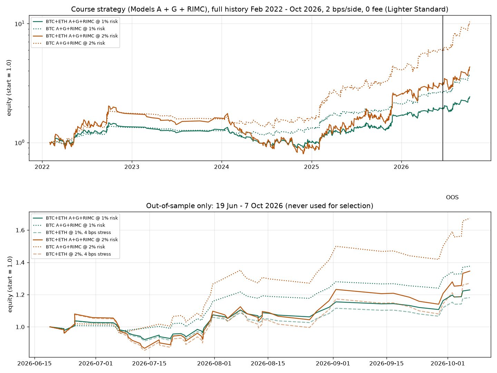

# BTC autopilot for Lighter (optional, runs on your Mac)

An unattended BTC-perp bot for [Lighter](https://app.lighter.xyz). It codes a set of multi-timeframe smart-money-concepts (SMC) rules from a trading course, checks them every minute on closed candles, and when a setup fires it places **one** grouped order on Lighter: entry + reduce-only stop-loss + reduce-only take-profit.

**This can lose money.** It is an experiment with a short out-of-sample record, not a proven system. It ships in **dry-run** (paper fills on live candles, nothing sent). Live trading needs you to pass `--live` yourself. Not financial advice.

## What it trades

- **BTC perp only.** Three setups, timed on a 4h / 15m / 3m stack (plus 5m and 1m for zones and triggers):
  - **A**: 3-layer trend continuation (4h trend, 15m pullback, 3m structure flip). Market entry, take-profit 3R or the structural target if closer.
  - **RIMC**: range, initiation, mitigation of the range edge, continuation. Market entry, 3R.
  - **G**: false first break / golden zone. A resting limit at the zone after a 5m false break, 24h expiry, 5R.
- Every closed 1m bar it pulls public BTC candles (Binance USD-M BTCUSDT, OKX fallback), rebuilds the backtest engine on the latest window and acts only on signals whose decision time is *now* (no lookahead, closed bars only). The engine files in `course_engine/` are the same code the backtest ran.
- Max hold 24h, then it closes at market (as in the backtest).

## Honest backtest summary

Binance 1m data, Feb 2022 to 7 Oct 2026, 2 bps slippage per side, Lighter Standard fees (0). Parameters were chosen on in-sample data (to 18 Jun 2026) only.

- **Out-of-sample (19 Jun to 7 Oct 2026), BTC, 1% risk:** 38 trades, 50% win rate, profit factor about 2.7, +37.6%, max drawdown -3.4%. With 4 bps/side stress costs: PF 2.37.
- **In-sample (Feb 2022 to Jun 2026), 1% risk:** 281 trades, PF 1.56, max drawdown -17%. 2023 was negative (-5.5%) and 2024 roughly flat (+2.7%); the gains cluster in 2022, 2025 and 2026.
- **ETH failed** with identical rules (it loses or breaks even), which is why this is BTC-only and why the BTC result may partly be luck or selection bias. About 11,000 configurations were searched.
- 38 out-of-sample trades is a small sample. Treat the numbers as "promising, unproven".
- **It is not true scalping.** Real scalping timeframes (1h/5m/1m) lost money on almost every setting: fees and slippage against tiny stops ate the edge. Expect roughly **1-2 trades a week**, held a few hours up to 24h.
- Backtests ignore funding, use Binance prices instead of Lighter fills, and measure drawdown on closed trades. Live results will differ.



## Guardrails (in `config.json`)

- **Risk 1% of live equity per trade by default.** You can lower it; the code refuses anything above a 2% hard ceiling.
- Size = risk ÷ stop distance, shrunk further to a **3x leverage cap**.
- **One position at a time.** Every entry carries an exchange-side reduce-only stop and take-profit in the same order group. If a stop or TP goes missing it is re-placed; if a stop can't be placed, the position is closed.
- **Daily loss stop -4%** (UTC day): no new entries until the next day.
- **Drawdown pause -15%** from the equity peak: no new entries until you run `resume`.
- **Kill switch:** `autopilot.py stop` (or create the file `~/.degen-desk/autopilot/STOP`) cancels BTC orders, closes the BTC position and keeps the bot stopped, also after a reboot.
- On start it reconciles with the exchange and never double-opens. A BTC position it didn't open gets a protective stop and no new trades.
- It never withdraws or transfers, and never touches other markets' positions.

## Requirements

- A Mac (it runs as a launchd agent and keeps the Mac awake only while running). Lighter blocks most cloud servers (`restricted jurisdiction`, code 20558), so it must run on your own computer, and only where [Lighter's terms](https://lighter.xyz/terms) allow your location. **Don't use a VPN or proxy** to get around that.
- Python 3.9+.
- The Degen Desk Lighter setup done first (see the main README, "Lighter perps"): a Lighter **sub-account holding only trading money**, an API key in slot 4-254, `lighter/install-local.sh` run with your account index and slot, and the key stored in your macOS Keychain (`security add-generic-password -U -a lighter -s degen-desk-lighter -w`). The autopilot reads your account index and slot from the `~/.degen-desk/lt` runner that installer creates. It never asks for, prints or stores the key.

## Install

```bash
# 1. get the files
curl -fsSL https://github.com/sheldonivish/degen-desk/archive/refs/heads/main.tar.gz | tar xz -C /tmp
# 2. install and start in DRY-RUN (paper fills, nothing sent)
bash /tmp/degen-desk-main/autopilot/install.sh
```

It copies the bot to `~/.degen-desk/autopilot/`, creates a venv (numpy only), checks it can reach the candle feed and your Lighter account (keyless), and starts the launchd job `com.degendesk.autopilot` in dry-run.

**Run dry-run for a while first** (weeks, not hours: it may go days without a trade). Compare its paper trades with the backtest. Only then, if you accept the risk:

```bash
bash /tmp/degen-desk-main/autopilot/install.sh --live
```

In live mode `run.sh` reads the key from your Keychain at start (macOS may ask once; click Always Allow), checks it matches your account and slot, and only then trades. With no key in the Keychain it exits without trading. Re-running `install.sh` updates the code and keeps your `config.json`.

## Use it

```bash
AP=~/.degen-desk/autopilot; PY=$AP/venv/bin/python3
$PY $AP/autopilot.py status          # equity, position, today's PnL, guardrails, last signals, recent trades
$PY $AP/autopilot.py pause           # no new entries (an open trade keeps its stop/TP)
$PY $AP/autopilot.py resume          # clear a pause or drawdown pause
```

Settings live in `~/.degen-desk/autopilot/config.json` (risk is a fraction: `0.01` = 1%). Restart after editing: `$PY $AP/autopilot.py start`. Logs: `log.jsonl`, `trades.csv`, `status.json`, `daemon.*.log` in the same folder. Optional Telegram trade alerts are off by default (`telegram.enabled`, your own bot token in the Keychain item `degen-desk-telegram`).

## Stop it

```bash
$PY $AP/autopilot.py stop                         # kill switch: cancel BTC orders, close the BTC position, stay stopped
$PY $AP/autopilot.py start                        # undo the kill switch and restart
bash $AP/uninstall.sh                             # kill switch + remove the launchd job (keeps logs)
bash $AP/uninstall.sh --keep-position --purge     # remove without closing the position, and delete the folder
```

You can always close the position and cancel orders yourself in the Lighter app.

## Risks (read these)

- A Lighter API key can trade, change leverage and make secure withdrawals to your own wallet. There is no trade-only key. Keep only money you can afford to lose in that sub-account.
- Stops can slip or gap in fast markets; leverage can liquidate. An unattended bot can keep losing during a bad stretch (the backtest's worst losing streak was 9 trades in a row).
- If your Mac sleeps, loses internet or shuts down, the bot stops watching. The exchange-side stop and TP stay on Lighter.
- Past performance, and especially backtests, don't predict future results. **Not financial advice.**

## Files

`autopilot.py` (loop + CLI) · `strategy.py` (live wrapper around the engine) · `course_engine/{engine,setups,sim}.py` (the backtest engine) · `feed.py` (candles) · `exchange.py` (paper + Lighter) · `notify.py` (optional Telegram) · `run.sh` (launchd entry, reads the key only for `--live`) · `install.sh` / `uninstall.sh` · `com.degendesk.autopilot.plist` · `config.default.json`
